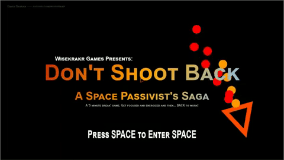

# DSMS_redux
This game is called Don't Shoot Back. It is a tiny Html/Javascript version of Don't Shoot My Spaceship https://github.com/wisekrakr/DSMS

My Goal: Learn javascript in a short amount of time.
Motive: js13kGames--> make a html/javascript game under 13kb zipped
Inspiration: A game people can play for 5 minutes to blow off some steam, get the blood pumping...all that jazz.
Conclusion: After a month...all was accomplished (but there is still a lot to learn)

The Game is an asteroids homage. It is the Dark Souls of space games. Super hard to get to the end. Survive for 5 minutes while 
asteroids bump into you and enemies try to destroy you. Protect planets from falling asteroids and escort helpless travelers.
Accumulate points by dodging lasers and making them hit asteroids. Make enemies follow you into a asteroid belt or meteor storm and
let them destroy themselves.
Do all this for 5 minutes and fight The Boss of Space! And then BACK to work.

The engine will run and update the game.  
The game-engine will create objects and handles various object related calculations, like distance or angle between objects.  
  This will also handle collisions between objects, which are initiated within the object class itself.
The main class will start the game, handles updating drawing objects and removing them.  
The display will hold all functions that initiate shapes and text on the screen. The canvas is created here. 
The controller will handle key inputs. 
The audio will hold functions to create sounds that can be used all over the game. 
The game class will initiate object in game and updates score. It will also handle updating all objects, as well as the world itself. 
The world class will handle the game mechanics and level progression. 

Play it here https://wisekrakr.github.io/DSMS_redux/index.html

